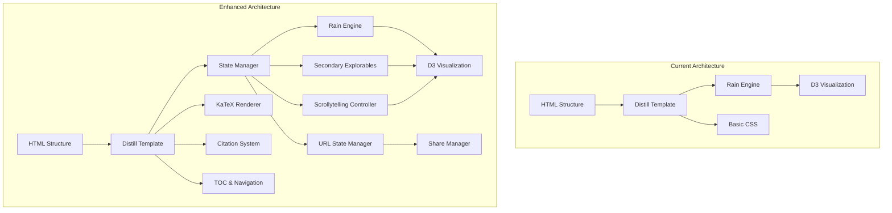

# Distill.pub Design Philosophy & UX Enhancement Plan

## Executive Summary

This document analyzes the design philosophy, UX patterns, and interactive elements used in Distill.pub publications and creates a comprehensive plan to apply these professional publication standards to the current Bayesian optimization interactive website project.

---

## Part 1: Distill.pub Design Philosophy Analysis

### 1.1 Core Design Principles

Distill.pub is renowned for its exceptional interactive technical articles. The following principles define their approach:

#### 1.1.1 Narrative-First Philosophy

- **Prose is primary**: Text drives the experience; interactive elements support the narrative
- **Controls are secondary**: UI controls should not compete with content
- **Progressive disclosure**: Concepts are revealed in logical sequence
- **Reading rhythm**: Visual pacing guides attention through the argument

#### 1.1.2 Typography Excellence

- **System font stack**: Native fonts for optimal rendering and readability
- **Careful line length**: 60-75 characters per line for optimal comprehension
- **Generous line height**: 1.6-1.7 for comfortable reading
- **Type scale**: Clear hierarchy with consistent sizing (12px, 13px, 14px, 16px, 20px, 36px, 50px)
- **KaTeX math rendering**: Beautiful mathematical typesetting inline and display

#### 1.1.3 Grid-Based Layout

- **12-column responsive grid**: Adapts elegantly across breakpoints
- **Layout classes**: `.l-body`, `.l-middle`, `.l-page`, `.l-screen` for content width control
- **Consistent spacing**: Modular scale (8px, 16px, 32px, 64px)
- **Gutter and margins**: Proper side margins and content gutters

#### 1.1.4 Color System

- **Minimal palette**: Black, white, grays, and one accent color
- **Purposeful contrast**: High contrast for text, subtle for UI elements
- **Semantic colors**: Consistent meaning (links, emphasis, warnings)
- **Dark/light themes**: Seamless theme switching with CSS custom properties

#### 1.1.5 Interactive Components

- **Explorable figures**: Embedded interactive visualizations
- **Direct manipulation**: Users control parameters directly
- **Immediate feedback**: Visual responses to all interactions
- **State persistence**: User choices are remembered
- **Replayability**: Interactions can be reset and replayed

---

## Part 2: Current Implementation Analysis

### 2.1 What Already Exists (Strengths)

| Aspect                          | Current Implementation                                                  | Distill Standard             |
| ------------------------------- | ----------------------------------------------------------------------- | ---------------------------- |
| **Article Structure**           | ✅ Distill-style (`d-front-matter`, `d-title`, `d-article`, `d-figure`) | Matches Distill              |
| **Typography**                  | ✅ Custom Avenir Next with proper weights                               | Comparable to Distill        |
| **Interactive Engine**          | ✅ Full Rain visualization with particles                               | Matches Distill quality      |
| **Accessibility**               | ✅ ARIA labels, keyboard nav, focus states, reduced-motion              | Meets Distill standards      |
| **Theme Support**               | ✅ Light/dark toggle with localStorage                                  | Matches Distill              |
| **Responsive Design**           | ✅ Grid-based with breakpoints                                          | Matches Distill              |
| **Math Rendering**              | ⚠️ Basic display                                                        | Needs KaTeX integration      |
| **Citation System**             | ⚠️ Basic references                                                     | Needs full Distill citations |
| **Scrollytelling**              | ❌ Not implemented                                                      | Missing Distill feature      |
| **Multiple Explorable Figures** | ❌ Single main interactive                                              | Needs expansion              |

### 2.2 Gap Analysis

#### High Priority Gaps

1. **Mathematical Typesetting**: No KaTeX integration for beautiful math
2. **Citation Infrastructure**: Missing `d-cite`, bibliography rendering
3. **Multiple Explorable Figures**: Only one major interactive; need smaller explorables
4. **Scrollytelling**: No scroll-driven interactions

#### Medium Priority Gaps

5. **Refined Typography**: System font stack vs custom fonts
6. **Table of Contents**: Sticky navigation
7. **Reading Progress**: Enhanced progress indicator
8. **Print Styles**: Print-optimized CSS

#### Lower Priority Enhancements

9. **Annotation System**: Marginalia and sidenotes
10. **Code Blocks**: Syntax highlighting
11. **Figure Captions**: Enhanced caption styling

---

## Part 3: Comprehensive Enhancement Plan

### Phase 1: Foundation Enhancements (Core Quality)

#### Task 1.1: Integrate KaTeX Mathematical Typesetting

**Files to modify**: `public/index.html`, create `public/js/katex-loader.js`

**Implementation steps**:

1. Add KaTeX CSS and JS to project (bundled locally for offline)
2. Create KaTeX loader module with proper initialization
3. Wrap mathematical expressions in appropriate delimiters
4. Ensure proper inline vs block rendering
5. Test dark theme compatibility

**Acceptance criteria**:

- Math renders beautifully inline and in display mode
- Theme toggle works with KaTeX
- No external CDN dependencies

---

#### Task 1.2: Complete Citation Infrastructure

**Files to modify**: `public/index.html`, `public/references.bib`, create `public/js/citation-renderer.js`

**Implementation steps**:

1. Populate `references.bib` with proper BibTeX entries
2. Implement citation rendering using Distill template patterns
3. Add hover previews for citations
4. Create proper reference list in appendix
5. Add citation styling matching Distill

**Acceptance criteria**:

- `[1]` style citations render correctly
- Clicking citation shows preview/popover
- References section displays full bibliography
- All citation keys resolve correctly

---

#### Task 1.3: Enhanced Typography System

**Files to modify**: `public/css/styles.css`

**Implementation steps**:

1. Refine font stack for better system integration
2. Add proper font loading with `font-display: swap`
3. Implement precise type scale matching Distill
4. Add optimal line-length containers (measure)
5. Enhance heading hierarchy styling

**Acceptance criteria**:

- Typography matches Distill's refined aesthetic
- Proper fallback fonts with no FOUT
- Line lengths stay within 60-75 character target
- All heading levels have clear hierarchy

---

### Phase 2: Interactive Enhancements (Engagement)

#### Task 2.1: Add Scrollytelling Interactions

**Files to modify**: `public/index.html`, create `public/js/scrollytelling.js`, `public/css/scrolly.css`

**Implementation steps**:

1. Implement scroll-driven state changes using Intersection Observer
2. Create narrative "steps" that trigger visualization updates
3. Add smooth transitions between scroll states
4. Ensure keyboard accessibility for scroll interactions
5. Add reduced-motion alternatives

**Acceptance criteria**:

- Scrolling through key sections triggers visual updates
- User can pause/resume automatic transitions
- Works with keyboard navigation
- Reduced-motion preserves understanding

---

#### Task 2.2: Create Secondary Explorable Figures

**Files to modify**: `public/index.html`, create `public/js/explorables/*.js`, `public/css/explorables.css`

**Implementation steps**:

1. Design 2-3 smaller explorable widgets:
   - Prior probability slider
   - Likelihood ratio calculator
   - Channel reliability visualizer
2. Embed within narrative flow using `d-figure`
3. Connect to shared state management
4. Ensure each is self-contained but interconnected

**Acceptance criteria**:

- Each explorable works independently
- Changes sync with main visualization
- Fit naturally in reading flow
- Load efficiently without blocking

---

#### Task 2.3: Enhanced Interactive Controls

**Files to modify**: `public/css/rain.css`, `public/js/rain/rain_engine.js`

**Implementation steps**:

1. Improve slider styling to match Distill quality
2. Add tooltips and inline help
3. Implement keyboard-accessible control panels
4. Add state snapshots (shareable URLs)
5. Enhance replay controls with step indicators

**Acceptance criteria**:

- All controls keyboard accessible
- Clear focus indicators
- Tooltips appear on hover/focus
- URL state sharing works

---

### Phase 3: Navigation & Reading Experience

#### Task 3.1: Sticky Table of Contents

**Files to modify**: `public/index.html`, `public/css/styles.css`

**Implementation steps**:

1. Create persistent TOC in sidebar on desktop
2. Implement scroll spy highlighting current section
3. Add smooth scroll to sections on click
4. Collapse to hamburger menu on mobile
5. Show reading progress per section

**Acceptance criteria**:

- TOC visible and useful on desktop
- Current section always highlighted
- Smooth scrolling works
- Mobile-friendly collapse

---

#### Task 3.2: Enhanced Reading Progress

**Files to modify**: `public/css/styles.css`, update `public/js/hider.js`

**Implementation steps**:

1. Refine scroll progress bar styling
2. Add section-by-section progress
3. Implement chapter completion indicator
4. Add "time remaining" estimation (optional)

**Acceptance criteria**:

- Progress bar is visible and useful
- Shows accurate reading progress
- Doesn't distract from content

---

#### Task 3.3: Print Styles Enhancement

**Files to modify**: `public/css/styles.css`

**Implementation steps**:

1. Add comprehensive print media queries
2. Ensure all interactive content is static in print
3. Optimize for A4/Letter paper
4. Hide navigation elements
5. Include proper page breaks

**Acceptance criteria**:

- Clean print output
- All content visible in print
- Proper page breaks at sections

---

### Phase 4: Polish & Professional Features

#### Task 4.1: Annotation & Sidenote System

**Files to modify**: `public/css/styles.css`, create `public/js/sidenotes.js`

**Implementation steps**:

1. Implement margin notes (sidenotes)
2. Add footnote toggle for mobile
3. Create citation popovers
4. Add highlight and annotation features

**Acceptance criteria**:

- Sidenotes appear in margin on desktop
- Footnotes accessible on mobile
- Citations show preview on hover

---

#### Task 4.2: Social & Sharing Features

**Files to modify**: `public/index.html`, create `public/js/sharing.js`

**Implementation steps**:

1. Add Twitter/LinkedIn share buttons
2. Implement URL state for sharing specific configurations
3. Add "copy link" functionality for sections
4. Create shareable static images of visualizations

**Acceptance criteria**:

- Social sharing works correctly
- Deep linking to sections works
- Shareable visualization snapshots

---

#### Task 4.3: Performance Optimization

**Files to modify**: Various JS and CSS files

**Implementation steps**:

1. Lazy load non-critical assets
2. Optimize D3 rendering
3. Add requestAnimationFrame throttling
4. Implement proper cleanup on page unload
5. Add performance budgets

**Acceptance criteria**:

- 60fps animations
- Fast initial load
- No memory leaks

---

## Part 4: Implementation Priority Matrix

| Priority | Task                  | Estimated Complexity | Impact |
| -------- | --------------------- | -------------------- | ------ |
| **P0**   | KaTeX Integration     | Medium               | High   |
| **P0**   | Citation System       | Medium               | High   |
| **P1**   | Typography Refinement | Low                  | Medium |
| **P1**   | Scrollytelling        | High                 | High   |
| **P1**   | Secondary Explorables | High                 | High   |
| **P2**   | Enhanced Controls     | Medium               | Medium |
| **P2**   | Table of Contents     | Medium               | Medium |
| **P2**   | Print Styles          | Low                  | Low    |
| **P3**   | Annotations           | Medium               | Medium |
| **P3**   | Social Features       | Low                  | Low    |
| **P3**   | Performance           | Medium               | Medium |

---

## Part 5: Technical Architecture

### Mermaid: Current vs Enhanced Architecture

---

## Part 6: File Modification Summary

### Files to Create

- `public/js/katex-loader.js` - KaTeX initialization
- `public/js/citation-renderer.js` - Citation handling
- `public/js/scrollytelling.js` - Scroll-driven interactions
- `public/js/explorables/prior-slider.js` - Secondary explorable
- `public/js/explorables/likelihood-calculator.js` - Secondary explorable
- `public/js/explorables/channel-visualizer.js` - Secondary explorable
- `public/js/scrolly.css` - Scrollytelling styles
- `public/js/explorables.css` - Explorable figure styles
- `public/js/sharing.js` - Social sharing
- `plans/distill-enhancement-plan.md` - This document

### Files to Modify

- `public/index.html` - Add new elements, integrate scripts
- `public/css/styles.css` - Typography, layout, print styles
- `public/css/rain.css` - Enhanced interactive controls
- `public/js/hider.js` - Theme, progress indicators
- `public/js/rain/rain_engine.js` - Connect to state manager
- `public/references.bib` - Add citation entries

---

## Part 7: Verification Checklist

### Pre-Implementation

- [ ] Review all acceptance criteria
- [ ] Test current implementation baseline
- [ ] Set up performance benchmarks

### Per-Task Verification

- [ ] Desktop layout renders correctly
- [ ] Mobile layout renders correctly
- [ ] Keyboard navigation works
- [ ] Reduced-motion works
- [ ] Theme toggle works
- [ ] No console errors
- [ ] Performance targets met

### Final Verification

- [ ] `npm run check` passes
- [ ] All interactives functional
- [ ] Accessibility audit passes
- [ ] Print output correct
- [ ] Matches Distill.pub quality bar

---

## Appendix: Reference Links

- Distill Guide: https://distill.pub/guide/
- Distill FAQ: https://distill.pub/faq/
- Communicating with Interactive Articles: https://distill.pub/2020/communicating-with-interactive-articles/
- Distill Template: https://github.com/distillpub/template
